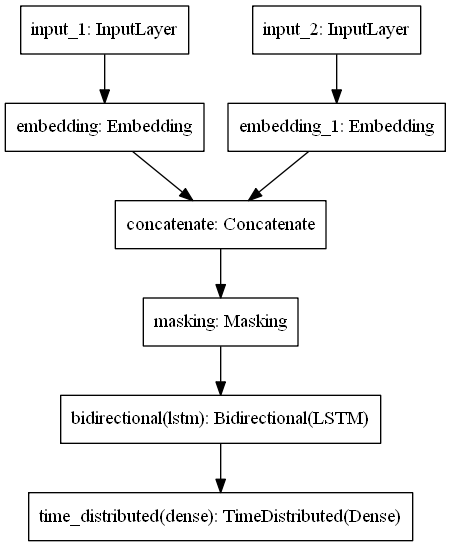

# NLP Homework 1

## Brief Introduction

- Replicate the SOTA paper for Chinese segmentation (Stacked BiLSTM or Unstacked BiLSTM model)

## Getting started

- get requirements `pip install requiremenets.txt`
- download dataset `wget http://sighan.cs.uchicago.edu/bakeoff2005/data/icwb2-data.zip`
- download pretrained embeddings `wget https://dl.fbaipublicfiles.com/fasttext/vectors-wiki/wiki.zh.vec`

## How it works

1. Read configuration files
2. Read dataset and preprocess it `preprocessing.py`
   1. Create input file, which is the same dataset but no spaces between words
   2. Create labels file, which is the BIES format as per line
      - BIES format >> B: beginning, I: Inside, E: End, S: Single
      - "The answer is 42!" -> "BIE BIIIIE BE BE S"
3. Process the dataset `dataset_handling.py`
   1. Get unique unigrams & Bigrams to create our vocabulary
      1. Save the vocabulary in json format for later use
   2. Get the labels of our classes (B, I, E, S)
   3. We need to pad data before passing it to the model
      1. 1st Option: Pad as per maximum length (user defined, improved by experimenting), as I did in `main.py`
      2. 2nd Option: Pad as per maximum length as per batch, as I did in `main_batch.py`
   4. After padding we need to change labels to one hot encoded matrix
4. Create our Bi-LSTM model with 256 cells, Nesterov Momentum SGD, with masking to mask our padded sequences
   - Since we pass data using two language models `1-grams` and `2-grams`, we need 2 input layers, 2 embeddings, and concatenate these embeddings, as shown in the below figure, model implementation `model.py`
   - 
5. Train the model
   1. If we took padding option #01: we train on the whole data `model.fit()`
   2. If we took padding option #02: we train as per batch `train_on_batch()`
   - model was trained used pretrained embedding
   - either or, I set `EarlyStopping` to avoid overfitting, `ModelCheckpoint` to save best model every 5 epochs, as well as, `ReduceLROnPlateau` so model don't get stuck in saddle point/shoulder
6. Evaluate the model

## TODOs [the plan I followed]

### Phase I [Preprocessing]

- [x] Download Chinese Datasets
- [x] Simplify Chinese Datasets, using `Hanzi Conv`
  - [x] Install hanziconv >> `pip install hanziconv`
  - [x] execute `hanzi-convert -o 'OUTFILE_NAME' -s 'INFILE_NAME'`
  - [x] automate the process of it
- [x] BIES format implementation on an English dataset
  - [x] Produce input file (same as original file but with no whitespace)
  - [x] Produce labels file, only labels
- [x] Replicate BIES for Chinese dataset

---

### Phase II [Dataset handling]

- [x] Implement Read dataset method
- [x] Implement Generate Labels method
- [x] Implement Generate Batches method
- [x] Reformulate the code, to keep a nice tidy structure

---

### Phase III [Models]

- [x] Implement Char embeddings
  - [x] Implement `keras` unigrams and bigrams embeddings
  - [x] Use pretrained embeddings ['GloVe']
- [x] Implement paper 1st model (Bi-LSTM: unstacked) using `keras`
- [x] Implement paper 2nd model (Bi-LSTM: stacked) using `keras`
- [x] Split data, train-dev: 80-20
- [x] `Tensorboard` variables
- [x] Save & load model weights functionality
- [x] Train the model(s)
  - [x] Loss & acc function, to mask zeros done by `pad_sequence`
- [x] plot the models
- [x] break sentences of length more than max_length into list of sentences
- [x] Use dev set to evaluate the model
  - [x] Read the dataset
  - [x] Test the implementation
- [x] Concatenate all the datasets
  - [x] for training
  - [x] for dev

---

### Phase IV [Predict]

- [x] Construct a pipeline for the whole code
- [x] Save vocab dict to json file
- [x] Implement predict function
  - [x] Test implementation of predict function
- [x] Try using `score.py`

---

### Phase V [Hyperparameters tuning]

- [x] Tune the hyperparameters
  - [x] Apply manual `GridSearchCV` to find best params
    - [x] Learning rate [0.003, 0.004]
    - [x] L2 Regularizer

---

## Enhancements

- [ ] preprocessing.bies_format is over complicated
- [ ] preprocessing.text_bies_format is over complicated
